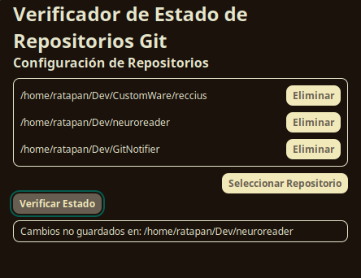

# GitNotifier

GitNotifier es una aplicación multiplataforma desarrollada con Tauri y Vue.js que ayuda a los desarrolladores a verificar el estado de sus repositorios Git antes de cerrar sesión en su sistema. La aplicación ofrece una interfaz intuitiva para gestionar las rutas de los repositorios y notifica al usuario si hay cambios no subidos, previniendo así la pérdida de trabajo no guardado.

## Propósito

El propósito de GitNotifier es asegurar que los desarrolladores no pierdan cambios importantes en sus repositorios Git al cerrar sesión o apagar su equipo sin subir los cambios. Esto es especialmente útil en entornos de desarrollo donde múltiples repositorios están en uso y los cambios no subidos pueden ser olvidados fácilmente.

## Funcionalidades

- **Verificación del Estado de los Repositorios Git:**
  - GitNotifier verifica si hay cambios no comiteados o no subidos en los repositorios especificados por el usuario.

- **Gestión de Rutas de Repositorios:**
  - La aplicación proporciona una interfaz de usuario para agregar, eliminar y listar rutas de repositorios.

- **Notificaciones:**
  - Notifica al usuario sobre el estado de los repositorios antes de cerrar sesión, asegurando que todos los cambios estén comiteados y subidos.

## Capturas de Pantalla


*Descripción de la pantalla principal de GitNotifier*

## Cómo Funciona

1. **Agregar Repositorios:**
   - Los usuarios pueden agregar rutas a sus repositorios Git a través de un diálogo de selección de directorios.

2. **Verificar Estado:**
   - Antes de cerrar sesión, los usuarios pueden verificar el estado de todos los repositorios listados. La aplicación mostrará un mensaje indicando si hay cambios no subidos.

3. **Notificaciones:**
   - Si hay cambios no subidos, GitNotifier notificará al usuario para que tome acción antes de cerrar sesión o apagar el equipo.

## Tecnologías Utilizadas

- **Tauri:** Framework para construir aplicaciones de escritorio multiplataforma con tecnologías web.
- **Vue.js:** Framework progresivo de JavaScript utilizado para construir la interfaz de usuario.
- **Rust:** Lenguaje de programación utilizado en el backend de Tauri para mejorar la seguridad y el rendimiento.

## Instalación y Uso

1. **Clonar el Repositorio:**

    ```bash
    git clone https://github.com/tu-usuario/GitNotifier.git
    cd GitNotifier
    ```

2. **Instalar Dependencias:**

    ```bash
    pnpm install
    ```

3. **Configurar Iconos:**

    Coloca tu imagen `RTP.png` en el directorio raíz del proyecto y ejecuta:

    ```bash
    cargo tauri icon RTP.png
    ```

4. **Desarrollo:**

    Para iniciar la aplicación en modo de desarrollo, ejecuta:

    ```bash
    pnpm tauri dev
    ```

5. **Compilación:**

    Para compilar la aplicación para distribución, ejecuta:

    ```bash
    pnpm tauri build
    ```

## Contribuciones

¡Las contribuciones son bienvenidas! Si tienes sugerencias o encuentras algún problema, por favor abre un issue o envía un pull request.

## Licencia

Este proyecto está bajo la licencia MIT. Consulta el archivo `LICENSE` para más detalles.
